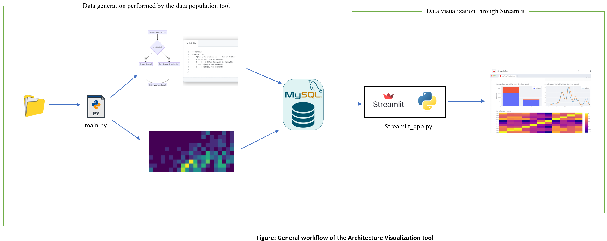

# Architecture visualization tool.

The visualization tool constitutes of two modules:

1. A [Data analysis tool](https://github.com/SmartDeltaFraunhoferFOKUS/Architecture_Visualization_Tool/tree/master/data_analysis_tool): computes different architectural views from the given input and stores them in a database. 
2. A [Visualization dashboard](https://github.com/SmartDeltaFraunhoferFOKUS/Architecture_Visualization_Tool/tree/master/streamlit_dashboard): uses the computed data in the database to create a visualization Dashboard.

The general workflow is depicted below:




## Running the Dashboard with pre-computed data

To have a quick overview of the Dashboard, we have already created a database with data populated by running the diagram analysis tool on mock datasets (Knuth elevator simulation logs and simple calculator operation logs)

This data can already be used to view sample visualizations via the Dashboard. 

The [docker-compose](https://github.com/SmartDeltaFraunhoferFOKUS/Architecture_Visualization_Tool/blob/master/docker-compose.yaml) file in this directory launches two containers, 
a. a mysqldb container containing the database with computed data, ready for visualization, 
b. a [streamlit](https://streamlit.io/) based visualization dashboard that attaches to this database.  

For a demo of the Dashboard, just run:

```bash
docker-compose up --build
```

The Dashboard is then exposed to 8501 port. Access as:
```bash
http://localhost:8501/
```