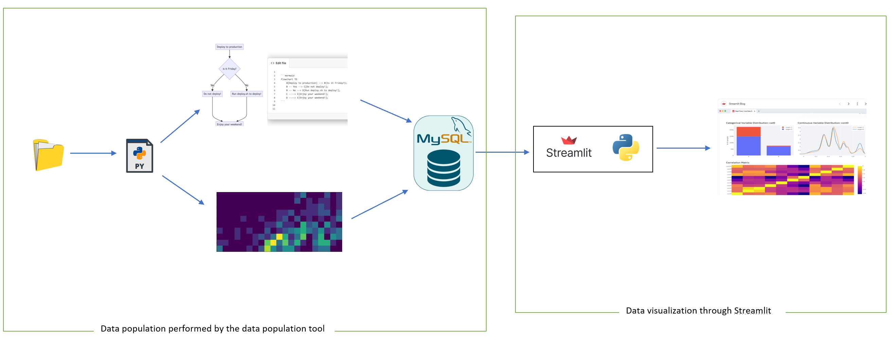

# Architecture visualization Dashboard.

The repo contains two applications:
1. A [Data population tool](https://github.com/SmartDeltaFraunhoferFOKUS/Architecture_Visualization_Tool/tree/master/data_population_tool) to compute necessary data for different views. 
2. A [Streamlit dashboard](https://github.com/SmartDeltaFraunhoferFOKUS/Architecture_Visualization_Tool/tree/master/streamlit_dashboard) that uses the computed data to create a Dashboard.

The general workflow is depicted below:

