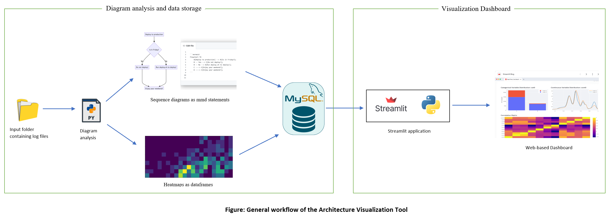

# Architecture analysis and visualization tool.

In the context of complex software systems with multiple interrelated modules, the tools to automatically analyze artifacts and generate graphical representations of architecture can enhance understanding of the system's structure, design issues, and run-time interactions among various components. Additionally, in dynamic, high-change environments, these tools offer valuable insights into how the software evolves over time. In this regard, the architecture analysis and visualization tool can be used to extract various architectural views from the given information.  

The tool computes various architectural views based on the input files. The data analysis module of the tool takes a set of files containing data from state machine executions as input. These log files consist of a sequence of state transitions, along with the events that cause them. Each of these files are analyzed to compute three distinct views: a run-time view which shows interaction among various components captured by a log file in the form of a sequence diagram, a state coverage heatmap that counts the number of times each state was visited during a particular run, and a heatmap similarity matrix which shows pair-wise similarity between each state coverage heatmap. These views are computed in a textual format (markdown-like syntax and dataframes) and are stored in a database. A graphical representation of the computed diagrams is then available through a web-based visualization dashboard.

Thus, the visualization tool constitutes of two modules:

1. A [Data analysis tool](https://github.com/SmartDeltaFraunhoferFOKUS/Architecture_Visualization_Tool/tree/master/Data_analysis_tool): computes different architectural views from the given input and stores them in a database. 
2. A [Visualization dashboard](https://github.com/SmartDeltaFraunhoferFOKUS/Architecture_Visualization_Tool/tree/master/Visualization_dashboard): uses the computed data in the database to create a visualization Dashboard.

The general workflow is depicted below:



Please follow the [wiki](https://github.com/SmartDeltaFraunhoferFOKUS/Architecture_Visualization_Tool/wiki) for more details.

**Note:** This is the initial version of the tool and the workflow and components may likely change overtime as the development progresses

## Running the Dashboard with pre-computed data

To have a quick overview of the Dashboard, we have already created a database with data populated by running the diagram analysis tool on mock datasets (Knuth elevator simulation logs and simple calculator operation logs)

This data can already be used to view sample visualizations via the Dashboard. 

The [docker-compose](https://github.com/SmartDeltaFraunhoferFOKUS/Architecture_Visualization_Tool/blob/master/docker-compose.yaml) file in this directory launches two containers, 

1. a mysqldb container containing the database with computed data, ready for visualization, 	
2. a [streamlit](https://streamlit.io/) based visualization dashboard that attaches to this database.  

For a demo of the Dashboard, just run:

```bash
docker-compose up --build
```

The Dashboard is then exposed to 8501 port. Access as:
```bash
http://localhost:8501/
```
